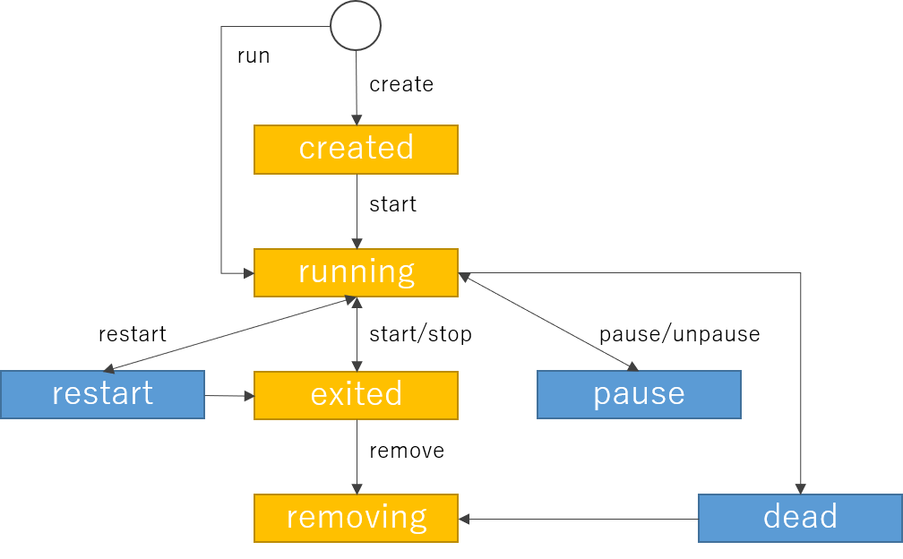

# 1. Docker の考え方

<$-- TOC -->
- [1. Docker の考え方](#1-docker-の考え方)
  - [1.1. コンテナについて](#11-コンテナについて)
  - [1.2. コンテナの状態遷移](#12-コンテナの状態遷移)
  - [1.3. インストール](#13-インストール)
- [2. Docker の使い方](#2-docker-の使い方)
  - [2.1. イメージファイルの操作](#21-イメージファイルの操作)
    - [2.1.1. 一覧表示](#211-一覧表示)
    - [2.1.2. イメージファイル削除](#212-イメージファイル削除)
  - [2.2. コンテナの制御](#22-コンテナの制御)
    - [2.2.1. コンテナの実行](#221-コンテナの実行)
    - [2.2.2. コンテナの停止](#222-コンテナの停止)
    - [2.2.3. コンテナの削除](#223-コンテナの削除)
    - [2.2.4. 実行中コンテナの一覧](#224-実行中コンテナの一覧)
    - [2.2.5. 実行済みコンテナの一括削除](#225-実行済みコンテナの一括削除)
  - [2.3. イメージファイルの公開](#23-イメージファイルの公開)
    - [2.3.1. タグ名を付ける](#231-タグ名を付ける)
    - [2.3.2. docker hub にログイン](#232-docker-hub-にログイン)
    - [2.3.3. イメージファイルのアップロード](#233-イメージファイルのアップロード)
    - [2.3.4. イメージファイルのpull](#234-イメージファイルのpull)
  - [2.4. docker-entrypoint.sh の書き方](#24-docker-entrypointsh-の書き方)
  - [2.5. dockerfile の作成、ビルド](#25-dockerfile-の作成ビルド)
    - [2.5.1. dockerfile の記載](#251-dockerfile-の記載)
    - [2.5.2. `docker build`](#252-docker-build)
  - [2.6. コンテナのシェルに接続](#26-コンテナのシェルに接続)
    - [2.6.1. `docker exec` を使用する場合](#261-docker-exec-を使用する場合)
    - [2.6.2. `docker attach` を使用する場合](#262-docker-attach-を使用する場合)
- [3. コンテナの情報](#3-コンテナの情報)
  - [3.1. コンテナのレイヤ情報](#31-コンテナのレイヤ情報)
  - [3.2. コンテナの構成情報補表示](#32-コンテナの構成情報補表示)

## 1.1. コンテナについて

docker コンテナは、レイヤーによって構成されている。他のコンテナでレイヤーに同じものが使われていたら、共有して利用するため、リソース消費量を抑えている。

## 1.2. コンテナの状態遷移



## 1.3. インストール

公式サイト通りにしたがって実施するとよいが、自分向けのインストール方法を記載する。

```bash
sudo apt install \
    apt-transport-https \
    ca-certificates \
    curl \
    gnupg-agent \
    software-properties-common

curl -fsSL https://download.docker.com/linux/ubuntu/gpg | sudo apt-key add -
sudo apt-key fingerprint 0EBFCD88
```

aptのソースリストにdockerを追加する。

```bash
cd /etc/apt/source.list.d
sudo vim docker.list
```

```vi
deb [arch=amd64] https://download.docker.com/linux/ubuntu focal stable
```

```bash
sudo apt update
sudo apt install docker-ce docker-ce-cli containerd.io
sudo usermod -aG docker yusuke
```

# 2. Docker の使い方

<!-- TOC -->
- [1. Docker の考え方](#1-docker-の考え方)
  - [1.1. コンテナについて](#11-コンテナについて)
  - [1.2. コンテナの状態遷移](#12-コンテナの状態遷移)
  - [1.3. インストール](#13-インストール)
- [2. Docker の使い方](#2-docker-の使い方)
  - [2.1. イメージファイルの操作](#21-イメージファイルの操作)
    - [2.1.1. 一覧表示](#211-一覧表示)
    - [2.1.2. イメージファイル削除](#212-イメージファイル削除)
  - [2.2. コンテナの制御](#22-コンテナの制御)
    - [2.2.1. コンテナの実行](#221-コンテナの実行)
    - [2.2.2. コンテナの停止](#222-コンテナの停止)
    - [2.2.3. コンテナの削除](#223-コンテナの削除)
    - [2.2.4. 実行中コンテナの一覧](#224-実行中コンテナの一覧)
    - [2.2.5. 実行済みコンテナの一括削除](#225-実行済みコンテナの一括削除)
  - [2.3. イメージファイルの公開](#23-イメージファイルの公開)
    - [2.3.1. タグ名を付ける](#231-タグ名を付ける)
    - [2.3.2. docker hub にログイン](#232-docker-hub-にログイン)
    - [2.3.3. イメージファイルのアップロード](#233-イメージファイルのアップロード)
    - [2.3.4. イメージファイルのpull](#234-イメージファイルのpull)
  - [2.4. docker-entrypoint.sh の書き方](#24-docker-entrypointsh-の書き方)
  - [2.5. dockerfile の作成、ビルド](#25-dockerfile-の作成ビルド)
    - [2.5.1. dockerfile の記載](#251-dockerfile-の記載)
    - [2.5.2. `docker build`](#252-docker-build)
  - [2.6. コンテナのシェルに接続](#26-コンテナのシェルに接続)
    - [2.6.1. `docker exec` を使用する場合](#261-docker-exec-を使用する場合)
    - [2.6.2. `docker attach` を使用する場合](#262-docker-attach-を使用する場合)
- [3. コンテナの情報](#3-コンテナの情報)
  - [3.1. コンテナのレイヤ情報](#31-コンテナのレイヤ情報)
  - [3.2. コンテナの構成情報補表示](#32-コンテナの構成情報補表示)

## 2.1. イメージファイルの操作

### 2.1.1. 一覧表示

```bash
docker image ls
docker images
```

### 2.1.2. イメージファイル削除

コンテナが実行されている場合は、エラーがでるので、コンテナを止めてから実施するか、強制的に削除する。

```bash
docker image rm [image_name|hash]
```

## 2.2. コンテナの制御

### 2.2.1. コンテナの実行

```bash
docker container run [image_name|hash]
```

### 2.2.2. コンテナの停止

```bash
docker container stop [image_name|hash]
```

### 2.2.3. コンテナの削除

```bash
docker rm [image_name]
```

### 2.2.4. 実行中コンテナの一覧

```bash
docker container ls -a
```

### 2.2.5. 実行済みコンテナの一括削除

```bash
docker container prune
```

## 2.3. イメージファイルの公開

### 2.3.1. タグ名を付ける

- [user_name]/[tag_name]:[version]
  - yusukeogata/test:v1.0.0

```bash
docker tag [src_tag_name] yusukeogata/text:v1.0.0
```

### 2.3.2. docker hub にログイン

```bash
docker login
```

- この後、ユーザ名(yusukeogata)とpw(1M)を入力

### 2.3.3. イメージファイルのアップロード

```bash
docker push [tag_name]
```

### 2.3.4. イメージファイルのpull

```bash
docker pull [tag_name]
```

## 2.4. docker-entrypoint.sh の書き方

```bash
#! /bin/sh

env

exec "$@"
```

## 2.5. dockerfile の作成、ビルド

### 2.5.1. dockerfile の記載

```bash
FROM centos:7

COPY docer-entrypoint.sh /var/tmp

RUN mv /var/tmp/docker-entrypoint.sh /usr/local/bin; \
    chmod +x /user/local/bin/docker-entprypoint.sh

ENTRYPOINT ["docker-entrypoint.sh"]
CMD["echo", "Hello World"]
```

### 2.5.2. `docker build`

```bash
docker build -t reverse_proxy .
```

- `-t` はタグ名を指定するオプション
- `.` はビルド資材の置き場所

## 2.6. コンテナのシェルに接続

### 2.6.1. `docker exec` を使用する場合

```bash
docker exec -it [container_name/container_id] /bin/bash
```

### 2.6.2. `docker attach` を使用する場合

```bash
docker attach [container_name/container_id]
```

- コンテナでシェルを実行している場合のみ、attach で接続できる。
- deamon が実行されていたりすると、deamon の標準入出力に接続されてしまう。
- exit で抜けた場合、PID1 のプロセスが終了し、コンテナが停止してしまう。
  - `ctrl+p ctrl+q` で抜けると、コンテは停止せずに、バックグラウンド実行できる
  - `-it ` オプションを付けていると、`ctrl+p ctrl+q` で抜けることができる。
  
シェルを起動した状態でコンテナ起動の例

```bash
docker run --name conntect-test -it -d ubuntu /bin/bash
```

# 3. コンテナの情報

## 3.1. コンテナのレイヤ情報

```bash
docker history [image_name]
```

## 3.2. コンテナの構成情報補表示

```bash
docker inspect [image_name]
```